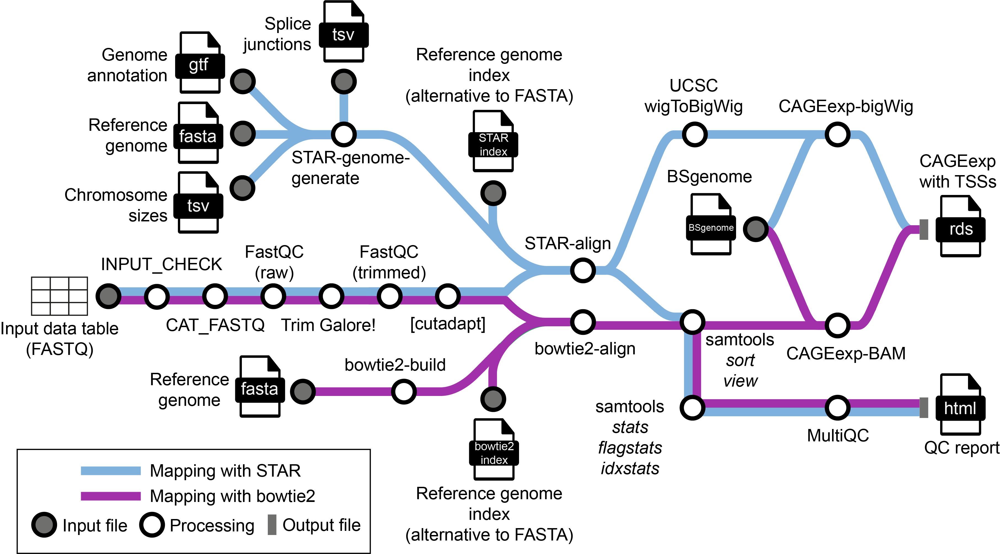

# &beta;

## To-do for version 2

### Features to implement

1. **[done]** `cutadapt` module for G trimming.

2. **[done]** `STAR` module for spliced alignment (instead of `HISAT2`):
   - Include filtering of alignments into the `STAR` command.
   - Include the generation of wigs into the `STAR` command to use as CAGEr input: to be able to use the spliced alignment, to speed up input reading and to have raw count tracks to look at in the genome browser.

3. **[done]** Make `STAR` the default aligner; allow running `bowtie2` instead of `STAR` with a `--bowtie2` option.

4. **[done]** Test the whole pipeline (`STAR` and `bowtie2`) with single-end reads.

5. **[done]** Implement the creation of a CAGEexp object from bigWigs, followed by TSS calling.

6. **[done]** Allow the user to skip G-trimming with cutadapt.

7. **[done]** Add splice sites as an optional input for genome indexing, separate from a GTF file.

8. **[done]** Include a FastQC report made after read trimming to the overall MultiQC report.
  
9. Building a `BSgenome` package and its installation on the fly for species with no `BSgenome` package on `Bioconductor`.

10. **[in progress]** `CAGEr` pipeline as a set of modules. Include plotting motifs around TSSs on both strands separately to check if a pyrimidine-purine (initiator-like) motif is present on both strands. This lets a user check if TSSs are shifted (are not a pyrimidine-purine pair) and/or initiator motifs are different on the two strands (neither should happen).

11. `CAGEfightR` (for enhancer calling, with a subsequent filtering by `CAGEr`-generated tag clusters).

12. Track generation for the genome browser (normalized counts).

13. Investigate and ideally resolve the issue with `CAGEr` using only one thread when reading samples and working within the pipeline. Get in touch with Charles Plessy after a reasonable investigation. (Damir discovered that CAGEr uses the number of thread equal to the number of read input files, independently of the number of threads set to it; but it is still unclear why CAGEr uses only one thread for multiple input samples when run within the pipeline.)

14. Tag cluster schematics generation for the genome browser using exon, intron and UTR glyphs.

### Finishing up

15. Check if the `nf-validation` Nextflow plugin or any other nf-core tools could help the user to create the input CSV.

16. Rename `input_reads.sh` into `make_input_csv.sh` for clarity.

17. **[in progress]** Make a "metromap" schematic of the pipeline. See, for example, the metromap for [nf-core/cutandrun](https://nf-co.re/cutandrun/3.2.1).

18. Cite in `CITATIONS.md` all the tools that we used.

19. Make it possible to run the pipeline by providing the GitHub repository name (and, possibly, a version name / commit hash), instead of making the user clone the repository first.

## Introduction

**ComputationalRegulatoryGenomicsICL/customcageq** is a Nextflow pipeline to process CAGE sequencing data from raw reads to the creation of a CAGEexp (CAGEr) object containing called TSSs. The pipeline is specifically designed to be used upstream of CAGEr.

### Input

Either single-end or paired-end raw CAGE reads. Only one type of reads (either single- or paired-end) can be used in one run of the pipeline.

### Output

A CAGEexp (CAGEr) object with called TSSs, ready for a downstream analysis with CAGEr. The intermediate and final results are stored in the `results` directory. The final CAGEexp object is stored in an RDS file in the `results/cager` directory.

### Map



### Steps

1. Merge per-lane FASTQ files with the [`nf-core/cat_fastq`](https://nf-co.re/modules/cat_fastq) module.
2. Report raw read quality with [`FastQC`](https://www.bioinformatics.babraham.ac.uk/projects/fastqc/).
3. Trim adapters with [`TrimGalore`](https://github.com/FelixKrueger/TrimGalore/blob/master/Docs/Trim_Galore_User_Guide.md).
4. Report trimmed read quality with [`FastQC`](https://www.bioinformatics.babraham.ac.uk/projects/fastqc/).
5. Trim the first `G` in forward reads (optional; done by default).
6. Build a [`STAR`](https://github.com/alexdobin/STAR) or [`bowtie2`](https://bowtie-bio.sourceforge.net/bowtie2/manual.shtml) index of the reference genome FASTA file, if the index is not provided. For the `STAR` index, use a mandatory list of chromosome sizes and an optional annotation in the GTF format and/or an optional list of splice junctions (see below for details).
7. Map trimmed reads onto the genome and filter alignments. If using `STAR`, then retain only the reads with at most 2 alignments (done within the `STAR` alignment module); if using `bowtie2`, then retain only the reads with $MAPQ\geq 20$ with [`samtools view`](https://www.htslib.org/doc/samtools-view.html).
8. Optionally, remove PCR and optical duplicate reads with [`samtools markdup`](https://www.htslib.org/doc/samtools-markdup.html) (not shown; see below for details).
9. Sort the obtained BAM files using [`samtools sort`](https://www.htslib.org/doc/samtools-sort.html).
10. Index the sorted BAM files with [`samtools index`](https://www.htslib.org/doc/samtools-index.html).
11. Assess mapping quality using [`samtools stats`](https://www.htslib.org/doc/samtools-stats.html), [`samtools flagstat`](https://www.htslib.org/doc/samtools-flagstat.html) and [`samtools idxstats`](https://www.htslib.org/doc/samtools-idxstats.html).
12. Create a CAGEexp object and call TSSs with [`CAGEr`](https://bioconductor.org/packages/release/bioc/html/CAGEr.html) using a [BSgenome package](https://bioconductor.org/packages/release/bioc/html/BSgenome.html) for the respective genome. If reads were mapped with `STAR`, then convert its 5'-coverage wig files into bigWig files to use as input for `CAGEr` (the `CAGEexp-bigWig` module); if reads were mapped with `bowtie2`, then use MAPQ-filtered and sorted BAM files as `CAGEr` input (the `CAGEexp-BAM` module).
13. Create a [MultiQC](https://multiqc.info/) report.

## Usage

### Prepare for your first run

Currently, pipeline works with Nextflow v23.04. Make sure that you have the latest version of Docker (if running the pipeline on a laptop / PC) or Singularity (if running on a high-performance cluster).

### Prepare your input data

Prepare the sample sheet with the description of input samples. In case of single-end reads, it should look like this:

```csv
sample,fastq_1,fastq_2,single_end
S1,/path/to/fastq/S1_S1_L001_R1_001.fastq.gz,,True
S1,/path/to/fastq/S1_S1_L002_R1_001.fastq.gz,,True
S2,/path/to/fastq/S2_S2_L001_R1_001.fastq.gz,,True
S2,/path/to/fastq/S2_S2_L002_R1_001.fastq.gz,,True
```

where
* `sample` is a unique identifier of a sample;
* `fastq_1` (and `fastq_2` in the case of paired-end reads) is a full path to the read libraries. In case of paired-end reads, `fastq_1` contains the full path to forward reads, while `fastq_2` contains the full path to reverse reads. One sample can be represented by more than one library if lanes are stored separately;
* `single_end` should be set to `True` for single-end reads and to `False` for paired-end reads.

For paired-end reads, `fastq_2` should contain the full path to reverse reads, while `single_end` should be set to `False`.

You can generate the input CSV table automatically using the [`input_reads.sh`](https://github.com/ComputationalRegulatoryGenomicsICL/customcageq/blob/dev/bin/input_reads.sh) script. It takes two positional arguments:

```bash
input_reads.sh /path/to/fastq_dir /path/to/samplesheet.csv
```

where
* `/path/to/fastq_dir` is a full path to a directory with raw FASTQ files;
* `/path/to/samplesheet.csv` is a file name, with a full path, of a CSV file to create.

To run the script as a standalone executable (that is, without the need to write `bash` before its name), add execution permissions to the script after cloning the repository:

```bash
chmod +x input_reads.sh
```

### Toy input data for testing

The pipeline has toy *S. cerevisiae* CAGE data stored in [assets/sacCer_fastq](https://github.com/ComputationalRegulatoryGenomicsICL/customcageq/tree/dev/assets/sacCer_fastq) for testing purposes (single-end reads in the [se](https://github.com/ComputationalRegulatoryGenomicsICL/customcageq/tree/dev/assets/sacCer_fastq/se) subfolder and paired-end reads in [pe](https://github.com/ComputationalRegulatoryGenomicsICL/customcageq/tree/dev/assets/sacCer_fastq/pe) subfolder). The single-end reads were obtained by subsampling the [ERR2495152](https://www.ebi.ac.uk/ena/browser/view/ERR2495152) dataset published by ([Börlin et al., 2018](https://academic.oup.com/femsyr/article/19/2/foy128/5257840)), while the paired-end reads were obtained by subsampling the [SRR1631657](https://www.ebi.ac.uk/ena/browser/view/SRR1631657) dataset published by ([Chabbert et al., 2015](https://www.embopress.org/doi/full/10.15252/msb.20145776)).

The corresponding *template* input spreadsheets can be found in [assets](https://github.com/ComputationalRegulatoryGenomicsICL/customcageq/tree/dev/assets): [samplesheet_sacer_se_template.csv](https://github.com/ComputationalRegulatoryGenomicsICL/customcageq/blob/dev/assets/samplesheet_sacer_se_template.csv) for single-end reads and [samplesheet_sacer_pe_template.csv](https://github.com/ComputationalRegulatoryGenomicsICL/customcageq/blob/dev/assets/samplesheet_sacer_pe_template.csv) for paired-end reads. You will need to add the absolute paths to the `customcageq` repository on your computer / HPC cluster to these templates to use them with the pipeline.

### How to run the pipeline

Clone the repository to your machine and use the following syntax to run the pipeline:

```bash
nextflow run customcageq/main.nf \
    --bsgenome [/path/to/]bsgenome.package[.tar.gz] \
    (--fasta /path/to/fasta/genome.fa (--chromsizes /path/to/chromsizes.tsv) | --index /path/to/index) \
    --input samplesheet.csv \
    [OPTIONAL_ARGUMENTS]
```

where 
* `--bsgenome` specifies the BSgenome R package to use. If it is a file name (which should have a full path and the `.tar.gz` extension), then the package will be taken from the specified location; otherwise, the pipeline will try to install a BSgenome R package with the name `bsgenome.package` on the fly (see examples below);
* `--fasta` specifies a path to a FASTA file containing a reference genome. This option is mandatory, unless `--index` is set. This option is mutually exclusive with `--index` and by default (when the `STAR` aligner is used) also requires the `--chromsizes` option.
* `--chromsizes` specifies a path to a TSV file with a list of chromosome sizes for the genome provided with the `--fasta` option. This option is mutually exclusive with `--index` and `--bowtie2` and, by default (when the `STAR` aligner is used), must accompany the `--fasta` option.
* `--index` specifies a directory with a genome index (`bowtie2` or `STAR`). This is a mandatory option, unless `--fasta` is set. This option is mutually exclusive with `--fasta`, `--gtf`, `--splicesites` and `--chromsizes`.
* `--input` specifies the input CSV samplesheet.
* [OPTIONAL_ARGUMENTS]:
    * `--bowtie2` switches the aligner from `STAR` to `bowtie2`. This option is mutually exclusive with `--gtf`, `--splicesites` and `--chromsizes` but is compatible with either `--index` or `--fasta`.
    * `--gtf` specifies a path to a GTF file with the genome annotation to use in the construction of a `STAR` genome index. This option is mutually exclusive with `--index` and `--bowtie2` and requires the `--fasta` option.
    * `--splicesites` specifies a path to a TSV file with a list of splice junctions (see the STAR manual, ... section, for the format). This option is mutually exclusive with `--index` and `--bowtie2` and requires the `--fasta` option.
    * `--params-trimgalore 'params'` specifies any options that can be passed to `TrimGalore!`. Useful for any non-standard read processing (for example, for CAGEscan reads that require the removal of fixed sequences from the 5'-ends of the forward and reverse reads). The parameters for `TrimGalore!` must be put in single quotes.
    * `--nogtrim` makes the pipeline skip the G-trimming step (done with `cutadapt` and executed after `TrimGalore!`, see the map above). This option is useful for processing non-CAGE data (for example, CAGEscan reads which do not have a 5'-`G` but instead require the removal of a fixed sequence ending with `GGG` from the 5'-end of the forward read). The option can be used together with `--params-trimgalore`.
    * `--dedup` switches on PCR duplicate removal (not shown in the pipeline map above and is switched off by default).
    * `--dist L` sets an optical duplicate distance `L` to remove optical duplicates, in addition to PCR duplicates (see [`samtools markdup`](https://www.htslib.org/doc/samtools-markdup.html), option `-d`). This option requires `--dedup`.
    * `-profile` is a Nextflow option that specifies a config file to use with Nextflow on a given machine. See [`nf-core/configs`](https://github.com/nf-core/configs) for ready-to-use institutional configs, including the one for Jex (the high-performance computing cluster of the [Laboratory of Medical Sciences](https://lms.mrc.ac.uk/)). Also, see the [Jex wiki](https://hpcwiki.lms.mrc.ac.uk/docs/software/software/workflow_managers/#nextflow) on how to run Nextflow on Jex. Alternatively, this option can be used to specify the containerization technology to use.
    * `-w` is a Nextflow option that specifies a path to the Nextflow work directory.

### Examples

1. Call TSSs from the test yeast single-end CAGE reads using a locally stored reference FASTA file and the `BSgenome.Scerevisiae.UCSC.sacCer1` R package. The package is automatically installed within the CAGEr container on the fly and used there with CAGEr:

```bash
nextflow run customcageq/main.nf \
    --bsgenome BSgenome.Scerevisiae.UCSC.sacCer1 \
    --fasta /path/to/fasta/sacCer1.fasta \
    --input customcageq/assets/samplesheet_se.csv \
    -profile docker
```

2. Call TSSs from the test yeast paired-end CAGE reads using a locally stored Bowtie2 index and the locally stored `BSgenome.Scerevisiae.UCSC.sacCer1` R package. The package is automatically installed from the `.tar.gz` archive within the CAGEr container and used with CAGEr:

```bash
nextflow run customcageq/main.nf \
    --bsgenome /path/to/bsgenome/BSgenome.Scerevisiae.UCSC.sacCer1_1.4.0.tar.gz \
    --index /path/to/index/bowtie2 \
    --input customcageq/assets/samplesheet_pe.csv \
    -profile docker
```

3. Same as example 1, but remove PCR duplicates before mapping QC and TSS calling:

```bash
nextflow run customcageq/main.nf \
    --bsgenome BSgenome.Scerevisiae.UCSC.sacCer1 \
    --fasta /path/to/fasta/sacCer1.fasta \
    --dedup \
    --input customcageq/assets/samplesheet_se.csv \
    -profile docker
```

4. Same as above, but remove both PCR and optical duplicates (at a maximum distance 100, see [`samtools markdup`](https://www.htslib.org/doc/samtools-markdup.html)) before mapping QC and TSS calling:

```bash
nextflow run customcageq/main.nf \
    --bsgenome BSgenome.Scerevisiae.UCSC.sacCer1 \
    --fasta /path/to/fasta/sacCer1.fasta \
    --dedup \
    --dist 100 \
    --input customcageq/assets/samplesheet_se.csv \
    -profile docker
```

## Credits

**ComputationalRegulatoryGenomicsICL/customcageq** has been developed by Pavel Nikitin ([@nikitin-p](https://github.com/nikitin-p)), Sviatoslav Sidorov ([@sidorov-si](https://github.com/sidorov-si)), Damir Baranasic ([@da-bar](https://github.com/da-bar)), Elena Gómez-Marín ([@ElenaGoMa](https://github.com/ElenaGoMa)).

## Citations

<!-- TODO nf-core: Add citation for pipeline after first release. Uncomment lines below and update Zenodo doi and badge at the top of this file. -->
<!-- If you use  ComputationalRegulatoryGenomicsICL/customcage for your analysis, please cite it using the following doi: [10.5281/zenodo.XXXXXX](https://doi.org/10.5281/zenodo.XXXXXX) -->

This pipeline uses code and infrastructure developed and maintained by the [nf-core](https://nf-co.re) community, reused here under the [MIT license](https://github.com/nf-core/tools/blob/master/LICENSE).

> **The nf-core framework for community-curated bioinformatics pipelines.**
>
> Philip Ewels, Alexander Peltzer, Sven Fillinger, Harshil Patel, Johannes Alneberg, Andreas Wilm, Maxime Ulysse Garcia, Paolo Di Tommaso & Sven Nahnsen.
>
> _Nat Biotechnol._ 2020 Feb 13. doi: [10.1038/s41587-020-0439-x](https://dx.doi.org/10.1038/s41587-020-0439-x).
