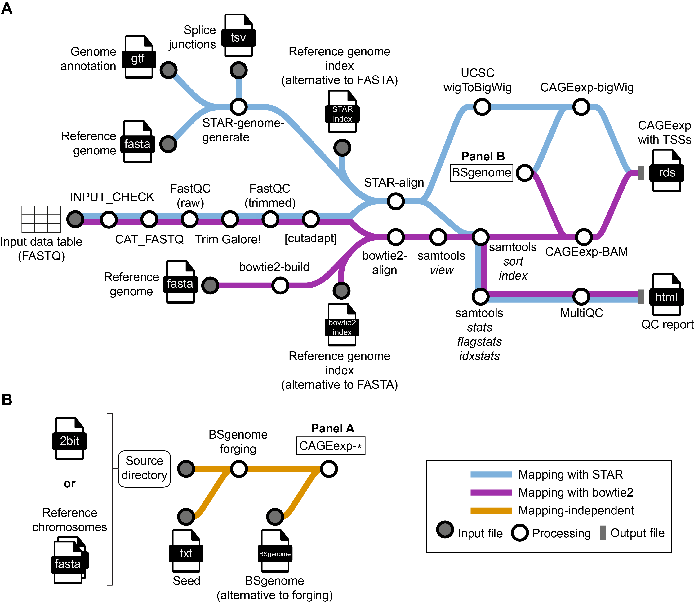

# &beta;

## To-do for version 2

### Features to implement

1. **[done]** `cutadapt` module for G trimming.

2. **[done]** `STAR` module for spliced alignment (instead of `HISAT2`):
   - Include filtering of alignments into the `STAR` command.
   - Include the generation of wigs into the `STAR` command to use as CAGEr input: to be able to use the spliced alignment, to speed up input reading and to have raw count tracks to look at in the genome browser.

3. **[done]** Make `STAR` the default aligner; allow running `bowtie2` instead of `STAR` with a `--bowtie2` option.

4. **[done]** Test the whole pipeline (`STAR` and `bowtie2`) with single-end reads.

5. **[done]** Implement the creation of a CAGEexp object from bigWigs, followed by TSS calling.

6. **[done]** Allow the user to skip G-trimming with cutadapt.

7. **[done]** Add splice sites as an optional input for genome indexing, separate from a GTF file.

8. **[done]** Include a FastQC report made after read trimming to the overall MultiQC report.
  
9. **[done]** Building a `BSgenome` package and its installation on the fly for species with no `BSgenome` package on `Bioconductor`.

10. `CAGEr` pipeline as a set of modules. Include plotting motifs around TSSs on both strands separately to check if a pyrimidine-purine (initiator-like) motif is present on both strands. This lets a user check if TSSs are shifted (are not a pyrimidine-purine pair) and/or initiator motifs are different on the two strands (neither should happen).

11. `CAGEfightR` (for enhancer calling, with a subsequent filtering by `CAGEr`-generated tag clusters).

12. Track generation for the genome browser (normalized counts).

13. Investigate and ideally resolve the issue with `CAGEr` using only one thread when reading samples and working within the pipeline. Get in touch with Charles Plessy after a reasonable investigation. (Damir discovered that CAGEr uses the number of thread equal to the number of read input files, independently of the number of threads set to it; but it is still unclear why CAGEr uses only one thread for multiple input samples when run within the pipeline.)

14. Tag cluster schematics generation for the genome browser using exon, intron and UTR glyphs.

### Finishing up

15. Check if the `nf-validation` Nextflow plugin or any other nf-core tools could help the user to create the input CSV.

16. **[done]** Rename `input_reads.sh` into `make_input_csv.sh` for clarity.
Actually, instead created an alternative input option. Either a samplesheet is given, OR an input path and a flag whether the data is single end or paired end (only one is accepted per run). When input path is given, no need to run the input checks and the creation of channels from the samplesheet file.

17. **[in progress]** Make a "metromap" schematic of the pipeline. See, for example, the metromap for [nf-core/cutandrun](https://nf-co.re/cutandrun/3.2.1).

18. Cite in `CITATIONS.md` all the tools that we used.

19. Make it possible to run the pipeline by providing the GitHub repository name (and, possibly, a version name / commit hash), instead of making the user clone the repository first.

## Introduction

**ComputationalRegulatoryGenomicsICL/customcageq** is a Nextflow pipeline to process CAGE sequencing data from raw reads to the creation of a CAGEexp (CAGEr) object containing called TSSs. The pipeline is specifically designed to be used upstream of CAGEr. Reads can be mapped using `STAR` (to take splacing into account and to obtain bigWig files with raw 5'-coverage; `STAR` is used by default) or `bowtie2` (see the `--bowtie2` option below). The pipeline can generate a genome index on the fly if provided with a FASTA file and, for `STAR` only, with a TSV file listing chromosome sizes. For genome generation with `STAR`, user can also provide a GTF and/or splice junction (TSV) files. Providing at least one of those files for the index generation is highly recommended ("While this is optional, and STAR can be run without annotations, using annotations is highly recommended whenever they are available" [STAR manual](https://github.com/alexdobin/STAR/blob/master/doc/STARmanual.pdf)). Apart from the CAGEexp object and raw 5'-coverage bigWig files (if reads were mapped with `STAR`), the pipeline produces BAM files with filtered alignments that could be used for a separate analysis and a detailed `MultiQC` report.

### Input

Either single-end (SE) or paired-end (PE) raw CAGE reads. Only one type of reads (either single- or paired-end) can be used in one run of the pipeline. The files of the reads can be listed in a samplesheet or a file path can be provided and the flag whether the input is SE or PE.

### Output

A CAGEexp (CAGEr) object with called TSSs, ready for a downstream analysis with CAGEr. The intermediate and final results are stored in the `results` directory. The final CAGEexp object is stored in an RDS file in the `results/cager` directory.

### Map



### Steps

1. Merge per-lane FASTQ files with the [`nf-core/cat_fastq`](https://nf-co.re/modules/cat_fastq) module.
2. Report raw read quality with [`FastQC`](https://www.bioinformatics.babraham.ac.uk/projects/fastqc/).
3. Trim adapters with [`TrimGalore`](https://github.com/FelixKrueger/TrimGalore/blob/master/Docs/Trim_Galore_User_Guide.md).
4. Report trimmed read quality with [`FastQC`](https://www.bioinformatics.babraham.ac.uk/projects/fastqc/).
5. Trim the first `G` in forward reads with [`cutadapt`](https://cutadapt.readthedocs.io/en/stable/) (optional; done by default).
6. Build a [`STAR`](https://github.com/alexdobin/STAR) or [`bowtie2`](https://bowtie-bio.sourceforge.net/bowtie2/manual.shtml) index of the reference genome FASTA file, if the index is not provided. For the `STAR` index, use a mandatory list of chromosome sizes and an optional annotation in the GTF format and/or an optional list of splice junctions (see below for details).
7. Map trimmed reads onto the genome and filter alignments. If using `STAR`, then retain only the reads with at most 2 alignments (done within the `STAR` alignment module); if using `bowtie2`, then retain only the reads with $MAPQ\geq 20$ with [`samtools view`](https://www.htslib.org/doc/samtools-view.html).
8. Optionally, remove PCR and optical duplicate reads with [`samtools markdup`](https://www.htslib.org/doc/samtools-markdup.html) (not shown; see below for details).
9. Sort the obtained BAM files using [`samtools sort`](https://www.htslib.org/doc/samtools-sort.html).
10. Index the sorted BAM files with [`samtools index`](https://www.htslib.org/doc/samtools-index.html).
11. Assess mapping quality using [`samtools stats`](https://www.htslib.org/doc/samtools-stats.html), [`samtools flagstat`](https://www.htslib.org/doc/samtools-flagstat.html) and [`samtools idxstats`](https://www.htslib.org/doc/samtools-idxstats.html).
12. Create a [BSgenome package](https://bioconductor.org/packages/release/bioc/html/BSgenome.html) for the reference genome, if the package is not available.
13. Create a CAGEexp object and call TSSs with [`CAGEr`](https://bioconductor.org/packages/release/bioc/html/CAGEr.html) using a [BSgenome package](https://bioconductor.org/packages/release/bioc/html/BSgenome.html) for the respective genome. If reads were mapped with `STAR`, then convert its 5'-coverage wig files into bigWig files to use as input for `CAGEr` (the `CAGEexp-bigWig` module); if reads were mapped with `bowtie2`, then use MAPQ-filtered and sorted BAM files as `CAGEr` input (the `CAGEexp-BAM` module).
14. Create a [MultiQC](https://multiqc.info/) report.

## Usage

### Prepare for your first run

Currently, pipeline works with Nextflow v23.04. Make sure that you have the latest version of Docker (if running the pipeline on a laptop / PC) or Singularity (if running on a high-performance cluster).

### Prepare your input data

Prepare the sample sheet with the description of input samples. In case of single-end reads, it should look like this:

```csv
sample,fastq_1,fastq_2,single_end
S1,/path/to/fastq/S1_S1_L001_R1_001.fastq.gz,,True
S1,/path/to/fastq/S1_S1_L002_R1_001.fastq.gz,,True
S2,/path/to/fastq/S2_S2_L001_R1_001.fastq.gz,,True
S2,/path/to/fastq/S2_S2_L002_R1_001.fastq.gz,,True
```

where
* `sample` is a unique identifier of a sample;
* `fastq_1` (and `fastq_2` in the case of paired-end reads) is a full path to the read libraries. In case of paired-end reads, `fastq_1` contains the full path to forward reads, while `fastq_2` contains the full path to reverse reads. One sample can be represented by more than one library if lanes are stored separately;
* `single_end` should be set to `True` for single-end reads and to `False` for paired-end reads.

For paired-end reads, `fastq_2` should contain the full path to reverse reads, while `single_end` should be set to `False`.

Alternatively, you may start by providing a path `/path/to/fastq/` to the folder containing the fastq files. The files will be automatically detected.  These can be paired-end or single-end, and can be located in a subfolder as illustrated below.

```
/path/to/fastq/S1/S1_S1_L001_R1_001.fastq.gz
/path/to/fastq/S1/S1_S1_L002_R1_001.fastq.gz
/path/to/fastq/S2/S2_S2_L001_R1_001.fastq.gz
/path/to/fastq/S2/S2_S2_L002_R1_001.fastq.gz
```


### Toy input data for testing

The pipeline has toy *S. cerevisiae* CAGE data stored in [assets/sacCer_fastq](https://github.com/ComputationalRegulatoryGenomicsICL/customcageq/tree/dev/assets/sacCer_fastq) for testing purposes (single-end reads in the [se](https://github.com/ComputationalRegulatoryGenomicsICL/customcageq/tree/dev/assets/sacCer_fastq/se) subfolder and paired-end reads in [pe](https://github.com/ComputationalRegulatoryGenomicsICL/customcageq/tree/dev/assets/sacCer_fastq/pe) subfolder). The single-end reads were obtained by subsampling the [ERR2495152](https://www.ebi.ac.uk/ena/browser/view/ERR2495152) dataset published by ([Börlin et al., 2018](https://academic.oup.com/femsyr/article/19/2/foy128/5257840)), while the paired-end reads were obtained by subsampling the [SRR1631657](https://www.ebi.ac.uk/ena/browser/view/SRR1631657) dataset published by ([Chabbert et al., 2015](https://www.embopress.org/doi/full/10.15252/msb.20145776)).

The corresponding *template* input spreadsheets can be found in [assets](https://github.com/ComputationalRegulatoryGenomicsICL/customcageq/tree/dev/assets): [samplesheet_sacer_se_template.csv](https://github.com/ComputationalRegulatoryGenomicsICL/customcageq/blob/dev/assets/samplesheet_sacer_se_template.csv) for single-end reads and [samplesheet_sacer_pe_template.csv](https://github.com/ComputationalRegulatoryGenomicsICL/customcageq/blob/dev/assets/samplesheet_sacer_pe_template.csv) for paired-end reads. You will need to add the absolute paths to the `customcageq` repository on your computer / HPC cluster to these templates to use them with the pipeline.

### How to run the pipeline

Clone the repository to your machine and use the following syntax to run the pipeline:

```bash
nextflow run customcageq/main.nf \
    (--bsgenome [/path/to/]bsgenome.package[.tar.gz] | --forgeseed /path/to/bsgenome_forging.seed --sourcedir /path/to/seqs_srcdir) \
    (--fasta /path/to/fasta/genome.fa | --index /path/to/index) \
    --chromsizes /path/to/chromsizes.tsv \
    (--samplesheet /path/to/samplesheet.csv | --infolder /path/to/fastq) \
    [OPTIONAL_ARGUMENTS]
```

where 
* `--bsgenome` specifies the BSgenome R package to use. If it is a file name (which should have a full path and the `.tar.gz` extension), then the package will be taken from the specified location; otherwise, the pipeline will try to install a BSgenome R package with the name `bsgenome.package` on the fly (see examples below). This option is mutually exclusive with `--forgeseed` and `--sourcedir`.
* `--forgeseed` specifies a seed file for BSgenome forging (see the [Advanced BSgenomeForge usage vignette](https://bioconductor.org/packages/release/bioc/vignettes/BSgenomeForge/inst/doc/AdvancedBSgenomeForge.pdf) for details). The seed file should not contain the `seqs_srcdir` field (instead, the absolute or relative path to the source directory is set with the `--sourcedir` option, see below). This option requires `--sourcedir` and is mutually exclusive with `--bsgenome`.
* `--sourcedir` specifies a directory containing either a set of FASTA files, one per reference chromosome, or a 2bit file for the whole reference genome. See the [Advanced BSgenomeForge usage vignette](https://bioconductor.org/packages/release/bioc/vignettes/BSgenomeForge/inst/doc/AdvancedBSgenomeForge.pdf) for details. The seed file should be written according to the contents of this directory. This option requires `--forgeseed` and is mutually exclusive with `--bsgenome`.
* `--fasta` specifies a FASTA file containing a reference genome. This option is mandatory, unless `--index` is set. This option is mutually exclusive with `--index` and by default (when the `STAR` aligner is used) also requires the `--chromsizes` option.
* `--chromsizes` specifies a TSV file with a list of chromosome sizes. This option is mandatory when using the default `STAR` aligner (to convert its output wig files to bigWig files) but must not be used together with an optional argument `--bowtie2` (see below).
* `--index` specifies a directory with a genome index (`bowtie2` or `STAR`). This is a mandatory option, unless `--fasta` is set. This option is mutually exclusive with `--fasta`, `--gtf`, `--splicesites` and `--chromsizes`.
* `--samplesheet` specifies the input CSV samplesheet. This option is mutually exclusive with `--infolder`.
* `--infolder` specifies the folder within which the fastq files are. The files are searched in the subfolders too. The files are expected to be defined as <sample_identifier>_R{1,2}\*fastq.gz, where \* denotes any set of characters, and sample_identifier will be used in the downstream processes.
 This option is mutually exclusive with `--samplesheet`.
* `[OPTIONAL_ARGUMENTS]` can be:
    * `--params-trimgalore 'params'` specifies any options that can be passed to `TrimGalore!`. This option is useful for any non-standard read processing (for example, for CAGEscan reads that require the removal of a fixed number of nucleotides from the 5'-ends of the forward and reverse reads ([Bertin et al., 2017](https://www.nature.com/articles/sdata2017147))). The string with the parameters for `TrimGalore!` must be surrounded by single quotes.
    * `--nogtrim` makes the pipeline skip the G-trimming step. This option is useful for processing non-CAGE data (for example, CAGEscan reads which do not seem to require trimming of a 5'-`G` ([Bertin et al., 2017](https://www.nature.com/articles/sdata2017147))). This option can be used together with `--params-trimgalore` (see an example below).
    * `--gtf` specifies a GTF file with the genome annotation to use in the construction of a `STAR` genome index. This option is mutually exclusive with `--index` and `--bowtie2` and requires the `--fasta` option.
    * `--splicesites` specifies a TSV file with a list of splice junctions (see the [STAR manual](https://github.com/alexdobin/STAR/blob/master/doc/STARmanual.pdf), section *Using a list of annotated junctions* or the description of the `--sjdbFileChrStartEnd` STAR option, for the format of the file). This option is mutually exclusive with `--index` and `--bowtie2` and requires the `--fasta` option.
    * `--bowtie2` switches the aligner from `STAR` to `bowtie2`. This option is mutually exclusive with `--gtf`, `--splicesites` and `--chromsizes` but is compatible with either `--index` or `--fasta`.
    * `--dedup` switches on PCR duplicate removal (not shown in the pipeline map above and is switched off by default).
    * `--dist L` sets an optical duplicate distance `L` to remove optical duplicates, in addition to PCR duplicates (see [`samtools markdup`](https://www.htslib.org/doc/samtools-markdup.html), option `-d`). This option requires `--dedup`.
    * `-profile` is a Nextflow option that specifies a config file to use with Nextflow on a given machine. See [`nf-core/configs`](https://github.com/nf-core/configs) for ready-to-use institutional configs, including the one for Jex (the high-performance computing cluster of the [Laboratory of Medical Sciences](https://lms.mrc.ac.uk/)). Also, see the [Jex wiki](https://hpcwiki.lms.mrc.ac.uk/docs/software/software/workflow_managers/#nextflow) on how to run Nextflow on Jex. Alternatively, this option can be used to specify the containerization technology to use.
    * `-w` is a Nextflow option that specifies a path to the Nextflow work directory.
    * Any other Nextflow options (see [Nextflow command line interface](https://www.nextflow.io/docs/latest/cli.html)).

All pipeline options start with a double dash (`--`), while all Nextflow options start with a single dash (`-`).

### Examples

#### Paired-end reads with locally stored STAR index and BSgenome

Call TSSs from the test yeast paired-end CAGE reads using the locally stored test STAR index and the `BSgenome.Scerevisiae.UCSC.sacCer3` R package. The package will be automatically downloaded and installed within the CAGEr container on the fly and will be used there with CAGEr. To run this example, the user needs to provide full paths to the test FASTQ files in `samplesheet_sacer_pe_template.csv` and the path to a "scratch" (or any other convenient) storage space for the Nextflow work directory:

```bash
nextflow run customcageq/main.nf \
    --bsgenome BSgenome.Scerevisiae.UCSC.sacCer3 \
    --index customcageq/assets/sacCer3_genome/sacCer3_star_index/ \
    --chromsizes customcageq/assets/sacCer3_genome/sacCer3.chrom.sizes \
    --input customcageq/assets/samplesheet_sacer_pe_template.csv \
    -profile singularity \
    -w /path/to/scratch/work
```

This example represents a typical use case for processing CAGE data from an organism with an available, locally stored, STAR genome index and a corresponding BSgenome package available in Bioconductor. For example, this is a use case for human CAGE data processing with the hg38 or T2T-CHM13 assembly. Instead of the `singularity` profile, one may use their institution's Nextflow profile (see [publicly available institutional Nextflow profiles](https://nf-co.re/configs)).

#### Single-end reads with locally stored FASTA and GTF files

Call TSSs from the test yeast single-end CAGE reads using locally stored FASTA and GTF files (and an optional file with splice junctions) for `STAR` index generation on the fly, as well as a locally stored seed file and a source directory to build a BSgenome R package. The package will be automatically installed within the CAGEr container from the autogenerated `.tar.gz` archive and used with CAGEr. To run this example, the user needs to provide full paths to the test FASTQ files in `samplesheet_sacer_se_template.csv`, as well as paths to a locally stored seed file and a source directory:

```bash
nextflow run customcageq/main.nf \
    --forgeseed /path/to/bsgenome_forging.seed \
    --sourcedir /path/to/seqs_srcdir \
    --fasta customcageq/assets/sacCer3_genome/sacCer3.fa \
    --chromsizes customcageq/assets/sacCer3_genome/sacCer3.chrom.sizes \
    --gtf customcageq/assets/sacCer3_genome/sacCer3.ensGene.gtf \
    --splicesites customcageq/assets/sacCer3_genome/sacCer3_toy_splice_junctions.tsv \
    --input customcageq/assets/samplesheet_sacer_se_template.csv \
    -profile singularity
```

This example may suit for the processing of CAGE data from a new species for which the user has to build ("forge") a BSgenome package by themselves. After forging the BSgenome once, the user can copy the resulting `.tar.gz` file from `results/bsgenome` and reuse it in subsequent runs of the pipeline by setting the `--bsgenome` option, for example: `--bsgenome /path/to/bsgenome/BSgenome.Scerevisiae.UCSC.sacCer3_1.4.0.tar.gz`.

#### CAGEscan libraries

Call TSSs from FANTOM5 CAGEscan libraries (see, for example, [CAGEscan datasets from human primary cells by FANTOM5](https://fantom.gsc.riken.jp/5/datafiles/latest/basic/human.primary_cell.CAGEScan/)). These libraries require trimming of 9 nt from the 5'-ends of the forward reads and of 6 nt from the 5'-ends of the reverse reads and do not seem to require separate G-trimming ([Bertin et al., 2017](https://doi.org/10.1038/sdata.2017.147)). To run this example, the user needs to generate the `fantom5_cagescan_pe.csv` input table (see above) and provide a path to it and to the `STAR` index of the T2T-CHM13 v2.0 human genome assembly. Additionally, the user needs to provide chromosome sizes of the T2T-CHM13 assembly, as the `STAR` aligner is used here by default:

```bash
nextflow run customcageq/main.nf \
    --bsgenome BSgenome.Hsapiens.NCBI.T2T.CHM13v2.0 \
    --index /path/to/chm13_t2t_v2.0_star_index \
    --chromsizes /path/to/chm13_t2t_v2.0_chromsizes.tsv \
    --params-trimgalore '--clip_R1 9 --clip_R2 6' \
    --nogtrim \
    --input /path/to/fantom5_cagescan_pe.csv \
    -profile singularity
```

#### **Not recommended.**Paired-end with bowtie2 and duplicate removal

Call TSSs from the test yeast paired-end CAGE reads using `bowtie2` for read mapping. Additionally, remove PCR duplicates and optical duplicates at a maximum distance 100 (see [`samtools markdup`](https://www.htslib.org/doc/samtools-markdup.html)) before doing alignment QC and TSS calling:

```bash
nextflow run customcageq/main.nf \
    --bsgenome BSgenome.Scerevisiae.UCSC.sacCer3 \
    --bowtie2 \
    --index customcageq/assets/sacCer3_genome/sacCer3_bowtie2_index \
    --dedup \
    --dist 100 \
    --input customcageq/assets/samplesheet_sacer_pe_template.csv \
    -profile singularity
```

This example collects options that are **not recommended** but retained just in case. Using `bowtie2` does not allow accounting for splicing and makes CAGEr use BAM files, which slows the creation of the CAGEexp object considerably. Also, read deduplication is not recommended because CAGE reads, by design, come only from transcripts, with one read coming from the 5'-end of the transcript, which increases the probability of true duplicates, in comparison to whole-genome libraries, like ChIP-seq or ATAC-seq. The `--bowtie2` option can also be used with the `--fasta` option to build a `bowtie2` genome index on the fly, while the `--dedup` and `--dist` options can be used with the default `STAR` mapping.

#### Starting from params file

You can add your pipeline parameters to the `params.yaml` file too. The fields that are not needed should remain empty.

```
samplesheet: "customcageq/assets/samplesheet_sacer_pe_template.csv"
infolder:
bsgenome: "BSgenome.Scerevisiae.UCSC.sacCer3"
forgeseed:
sourcedir:
fasta:
index: "customcageq/assets/sacCer3_genome/sacCer3_star_index/"
chromsizes: "customcageq/assets/sacCer3_genome/sacCer3.chrom.sizes"
```

When running the pipeline you need to define the location of the `params.yaml` file with the flag `-params-file` and add the nextflow parameters as required.

```
nextflow run customcageq/main.nf -params-file customcageseq/params.yaml -profile singularity -w /path/to/scratch/work
```

## Credits

**ComputationalRegulatoryGenomicsICL/customcageq** has been developed by Pavel Nikitin ([@nikitin-p](https://github.com/nikitin-p)), Sviatoslav Sidorov ([@sidorov-si](https://github.com/sidorov-si)), Damir Baranasic ([@da-bar](https://github.com/da-bar)), Elena Gómez-Marín ([@ElenaGoMa](https://github.com/ElenaGoMa)),
Katalin Ferenc ([@ferenckata](https://github.com/ferenckata)).

## Citations

<!-- TODO nf-core: Add citation for pipeline after first release. Uncomment lines below and update Zenodo doi and badge at the top of this file. -->
<!-- If you use  ComputationalRegulatoryGenomicsICL/customcage for your analysis, please cite it using the following doi: [10.5281/zenodo.XXXXXX](https://doi.org/10.5281/zenodo.XXXXXX) -->

This pipeline uses code and infrastructure developed and maintained by the [nf-core](https://nf-co.re) community, reused here under the [MIT license](https://github.com/nf-core/tools/blob/master/LICENSE).

> **The nf-core framework for community-curated bioinformatics pipelines.**
>
> Philip Ewels, Alexander Peltzer, Sven Fillinger, Harshil Patel, Johannes Alneberg, Andreas Wilm, Maxime Ulysse Garcia, Paolo Di Tommaso & Sven Nahnsen.
>
> _Nat Biotechnol._ 2020 Feb 13. doi: [10.1038/s41587-020-0439-x](https://dx.doi.org/10.1038/s41587-020-0439-x).
