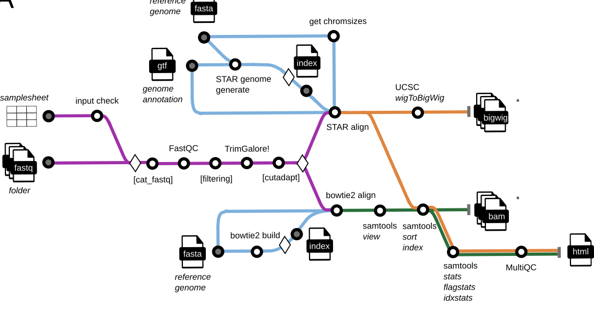
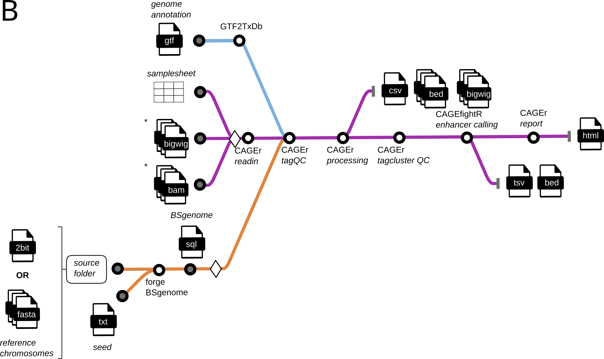

# ComputationalRegulatoryGenomicsICL/customcage: Documentation

## Map

The first part of the pipeline is shown here:

The second part of the pipeline is shown here:

## Pipeline overview

The pipeline is built using [Nextflow](https://www.nextflow.io/) and processes data using the following steps:

- Merge per-lane FASTQ files with the [`nf-core/cat_fastq`](https://nf-co.re/modules/cat_fastq) module.
- Report raw read quality with [`FastQC`](https://www.bioinformatics.babraham.ac.uk/projects/fastqc/).
- (optional) remove reads that DO NOT start with G.
- Trim adapters with [`TrimGalore`](https://github.com/FelixKrueger/TrimGalore/blob/master/Docs/Trim_Galore_User_Guide.md).
- Report trimmed read quality with [`FastQC`](https://www.bioinformatics.babraham.ac.uk/projects/fastqc/)
- (optional; done by default) Trim the first `G` in forward reads with [`cutadapt`](https://cutadapt.readthedocs.io/en/stable/).
- (optional) Build a [`STAR`](https://github.com/alexdobin/STAR) or [`bowtie2`](https://bowtie-bio.sourceforge.net/bowtie2/manual.shtml) index of the reference genome FASTA file, if the index is not provided. For the `STAR` index, use a mandatory genome annotation in a GTF format.
- Map trimmed reads onto the genome and filter alignments. If using `STAR`, then retain only the reads with at most 2 alignments (done within the `STAR` alignment module); if using `bowtie2`, then retain only the reads with $MAPQ\geq 20$ with [`samtools view`](https://www.htslib.org/doc/samtools-view.html).
- Convert wigs to bigWigs using [`UCSC wigtobigwig`](https://nf-co.re/modules/ucsc_wigtobigwig) module.
- (optional) Remove PCR and optical duplicate reads with [`samtools markdup`](https://www.htslib.org/doc/samtools-markdup.html). See below for details.
- Sort the obtained BAM files using [`samtools sort`](https://www.htslib.org/doc/samtools-sort.html).
- Index the sorted BAM files with [`samtools index`](https://www.htslib.org/doc/samtools-index.html).
- Assess mapping quality using [`samtools stats`](https://www.htslib.org/doc/samtools-stats.html), [`samtools flagstat`](https://www.htslib.org/doc/samtools-flagstat.html) and [`samtools idxstats`](https://www.htslib.org/doc/samtools-idxstats.html).
- [MultiQC](#multiqc) - Aggregate report describing results and QC from the mapping part of the pipeline
- Create a [BSgenome package](https://bioconductor.org/packages/release/bioc/html/BSgenome.html) for the reference genome, if the package is not available.
- Create a CAGEexp object and call TSSs with [`CAGEr`](https://bioconductor.org/packages/release/bioc/html/CAGEr.html) using a [BSgenome package](https://bioconductor.org/packages/release/bioc/html/BSgenome.html) for the respective genome. If reads were mapped with `STAR`, bigWig files to use as input for `CAGEr`; if reads were mapped with `bowtie2`, then use MAPQ-filtered and sorted BAM files as `CAGEr` input.
- Analysis of CAGE reads according to the manual of [`CAGEr`](https://www.bioconductor.org/packages/release/bioc/vignettes/CAGEr/inst/doc/CAGEexp.html). Final output is a markdown document summarizing the results and QC, as well as tracks: bed and bigwig files, a set of intermediate RDS files, stand-alone plots (all shown or referenced in the report), and data tables.
- [Pipeline information](#pipeline-information) - Report metrics generated during the workflow execution

The comprehensive ComputationalRegulatoryGenomicsICL/customcage documentation is split into the following pages:

- [Usage](usage.md)
  - An overview of how the pipeline works, how to run it and a description of all of the different command-line flags.
- [Output](output.md)
  - An overview of the different results produced by the pipeline and how to interpret them.
