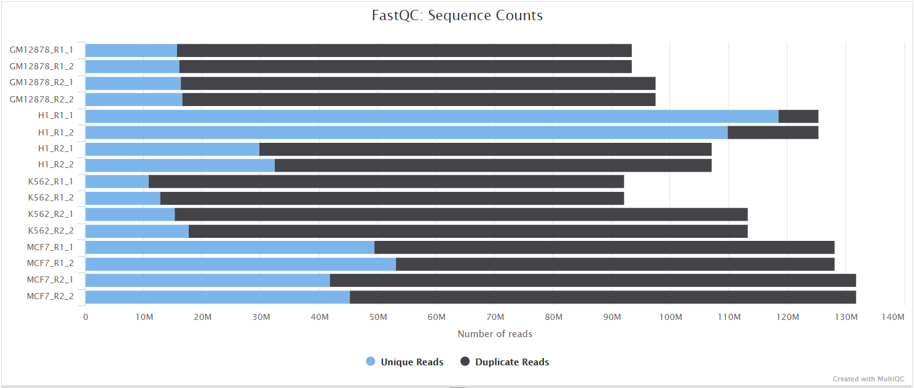
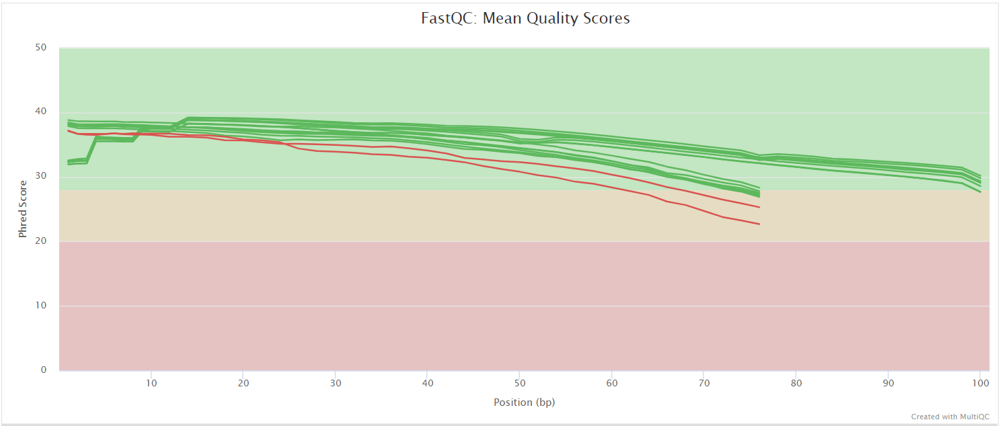
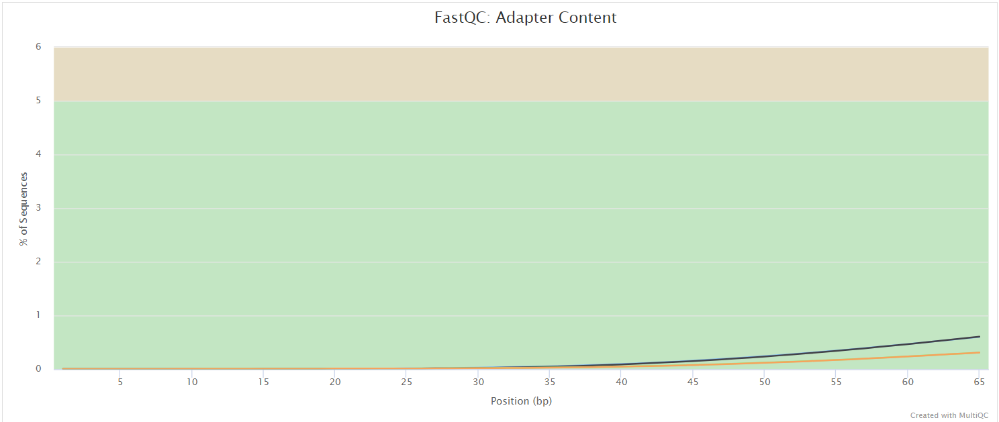

# ComputationalRegulatoryGenomicsICL/customcage: Output

## Introduction

This document describes the output produced by the pipeline. Most of the plots are taken from the MultiQC report, which summarises results at the end of the pipeline.

The directories listed below will be created in the results directory after the pipeline has finished. All paths are relative to the top-level results directory.

<!-- TODO nf-core: Write this documentation describing your workflow's output -->

### Map

The first part of the pipeline is shown here:

## Pipeline overview

The pipeline is built using [Nextflow](https://www.nextflow.io/) and processes data using the following steps:

- Merge per-lane FASTQ files with the [`nf-core/cat_fastq`](https://nf-co.re/modules/cat_fastq) module.
- Report raw read quality with [`FastQC`](https://www.bioinformatics.babraham.ac.uk/projects/fastqc/).
- (optional) remove reads that DO NOT start with G.
- Trim adapters with [`TrimGalore`](https://github.com/FelixKrueger/TrimGalore/blob/master/Docs/Trim_Galore_User_Guide.md).
- Report trimmed read quality with [`FastQC`](https://www.bioinformatics.babraham.ac.uk/projects/fastqc/)
- (optional; done by default) Trim the first `G` in forward reads with [`cutadapt`](https://cutadapt.readthedocs.io/en/stable/).
- (optional) Build a [`STAR`](https://github.com/alexdobin/STAR) or [`bowtie2`](https://bowtie-bio.sourceforge.net/bowtie2/manual.shtml) index of the reference genome FASTA file, if the index is not provided. For the `STAR` index, use a mandatory genome annotation in a GTF format.
- Map trimmed reads onto the genome and filter alignments. If using `STAR`, then retain only the reads with at most 2 alignments (done within the `STAR` alignment module); if using `bowtie2`, then retain only the reads with $MAPQ\geq 20$ with [`samtools view`](https://www.htslib.org/doc/samtools-view.html).
- Convert wigs to bigWigs using [`UCSC wigtobigwig`](https://nf-co.re/modules/ucsc_wigtobigwig) module.
- (optional) Remove PCR and optical duplicate reads with [`samtools markdup`](https://www.htslib.org/doc/samtools-markdup.html). See below for details.
- Sort the obtained BAM files using [`samtools sort`](https://www.htslib.org/doc/samtools-sort.html).
- Index the sorted BAM files with [`samtools index`](https://www.htslib.org/doc/samtools-index.html).
- Assess mapping quality using [`samtools stats`](https://www.htslib.org/doc/samtools-stats.html), [`samtools flagstat`](https://www.htslib.org/doc/samtools-flagstat.html) and [`samtools idxstats`](https://www.htslib.org/doc/samtools-idxstats.html).
- [MultiQC](#multiqc) - Aggregate report describing results and QC from the mapping part of the pipeline
- Create a [BSgenome package](https://bioconductor.org/packages/release/bioc/html/BSgenome.html) for the reference genome, if the package is not available.
- Create a CAGEexp object and call TSSs with [`CAGEr`](https://bioconductor.org/packages/release/bioc/html/CAGEr.html) using a [BSgenome package](https://bioconductor.org/packages/release/bioc/html/BSgenome.html) for the respective genome. If reads were mapped with `STAR`, bigWig files to use as input for `CAGEr`; if reads were mapped with `bowtie2`, then use MAPQ-filtered and sorted BAM files as `CAGEr` input.
- Analysis of CAGE reads according to the manual of [`CAGEr`](https://www.bioconductor.org/packages/release/bioc/vignettes/CAGEr/inst/doc/CAGEexp.html). Final output is a markdown document summarizing the results and QC.
- [Pipeline information](#pipeline-information) - Report metrics generated during the workflow execution

### FastQC

Output files

- `fastqc/`
  - `*_fastqc.html`: FastQC report containing quality metrics.
  - `*_fastqc.zip`: Zip archive containing the FastQC report, tab-delimited data file and plot images.

[FastQC](http://www.bioinformatics.babraham.ac.uk/projects/fastqc/) gives general quality metrics about your sequenced reads. It provides information about the quality score distribution across your reads, per base sequence content (%A/T/G/C), adapter contamination and overrepresented sequences. For further reading and documentation see the [FastQC help pages](http://www.bioinformatics.babraham.ac.uk/projects/fastqc/Help/).

:::note
The FastQC plots displayed in the MultiQC report shows _untrimmed_ reads. They may contain adapter sequence and potentially regions with low quality.
:::

### MultiQC

Output files

- `multiqc/`
  - `multiqc_report.html`: a standalone HTML file that can be viewed in your web browser.
  - `multiqc_data/`: directory containing parsed statistics from the different tools used in the pipeline.
  - `multiqc_plots/`: directory containing static images from the report in various formats.

[MultiQC](http://multiqc.info) is a visualization tool that generates a single HTML report summarising all samples in your project. Most of the pipeline QC results are visualised in the report and further statistics are available in the report data directory.

Results generated by MultiQC collate pipeline QC from supported tools e.g. FastQC. The pipeline has special steps which also allow the software versions to be reported in the MultiQC output for future traceability. For more information about how to use MultiQC reports, see <http://multiqc.info>.

### Pipeline information

Output files

- `pipeline_info/`
  - Reports generated by Nextflow: `execution_report.html`, `execution_timeline.html`, `execution_trace.txt` and `pipeline_dag.dot`/`pipeline_dag.svg`.
  - Reports generated by the pipeline: `pipeline_report.html`, `pipeline_report.txt` and `software_versions.yml`. The `pipeline_report*` files will only be present if the `--email` / `--email_on_fail` parameter's are used when running the pipeline.
  - Reformatted samplesheet files used as input to the pipeline: `samplesheet.valid.csv`.
  - Parameters used by the pipeline run: `params.json`.

[Nextflow](https://www.nextflow.io/docs/latest/tracing.html) provides excellent functionality for generating various reports relevant to the running and execution of the pipeline. This will allow you to troubleshoot errors with the running of the pipeline, and also provide you with other information such as launch commands, run times and resource usage.
